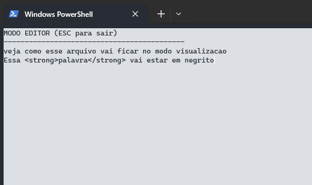

# Projeto Notepad em C#

Este é um projeto de um aplicativo de console simples em C# chamado "Notepad". O objetivo deste projeto é revisar os conceitos básicos de programação e o framework .NET.

## Capturas de Tela

## Recursos

1. Criação de novos arquivos
2. Abertura de arquivos existentes
3. Utilização de tags `<title></title>` para marcar o texto como título
4. Utilização de tags `<strong></strong>` para marcar o texto em negrito

## Como Usar

Para usar este aplicativo, você precisará ter o .NET Core instalado em sua máquina. Após a instalação, você pode clonar este repositório e executar o projeto usando o comando dotnet run.

## Contribuição

Contribuições são bem-vindas. Se você quiser contribuir para este projeto, sinta-se à vontade para submeter um pull request. Certifique-se de seguir o guia de estilo do .NET 2.

## Licença

Este projeto é licenciado sob a licença MIT. Para mais detalhes, consulte o arquivo LICENSE.
